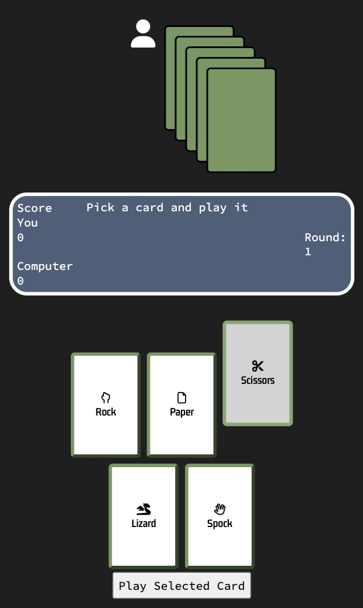

## Table of Contents

# RPSLS

Welcome to RPSLS, here you can play the game Rock, Paper, Scissors, Lizard, Spock. The rules are simple, just like Rock paper scissors but with lizards and Spock.

## Introduction

RPSLS is a web application that lets users enjoy a chance-based, single-user game against the computer online. RPSLS is based on the classic Rock Paper Scissors with added options. Users can pick a card to play. They can do so multiple rounds with the score recorded and displayed. A game consists of 5 rounds, after 5 rounds a winner is declared.

The winner is decided according to these rules:
* Scissors cuts Paper
* Paper covers Rock
* Rock crushes Lizard
* Lizard poisons Spock
* Spock smashes Scissors
* Scissors decapitates Lizard
* Lizard eats Paper
* Paper disproves Spock
* Spock vaporizes Rock
* Rock crushes Scissors

For more information see this page from one of the originators [ROCK PAPER SCISSORS SPOCK LIZARD](http://www.samkass.com/theories/RPSSL.html)

## Design

### Colour Scheme

I have chosen a dark-themed colour scheme for RPSLS where a simple and minimal colour combination of about four colour variations are picked. It uses green, blue, white and dark grey. As an online game, this colour scheme contributes to a strong visual contrast without being too overwhelming. For readability, the background remains contrasting to the colour of the text consistently.

### Typography

I have picked Gemunu Libre as the font for the cards on the web application. It is very readable while still maintaining the fun element of a game. For the game status board, I have picked Source Code Pro as the font as it fits the mood and the theme while still being very readable.

### Accessibility

* Semantic HTML is used as much as possible and conforming with best practices.
* Choosing a sans serif font for the site - these fonts are suitable for people with dyslexia.
* Ensuring that there is a sufficient colour contrast throughout the site.
* All links and buttons use some form of highlighting when hovered over to help convey that they are clickable.
* Visual - all text and images are clear, legible, and visible.
* Easy-to-navigate actions with large fonts and clear labels.
* Site resizes well to most device types and screen configurations.

### Wireframes

Wireframes were created for mobile and desktop versions

- Home page

- Home page mobile

## Features

* One html and JavaScript page with styles in one CSS file to create a uniform style
* Card game style aestethics.
* Five card options
* Five rounds of exciting Rock Paper Scissors Lizard Spock gameplay.
* CSS based animations when selecting cards.
* One button to play.
* One button to start a new game, this button is available after the page loads or after a game has finished, but not during a game.
* One game status counter with fields for score, round and narration.
* One CPU/computer player display on top of the site with its hand of cards face down to visualise computer as the competitor the user is playing against.
* All buttons react to hover so it's clear that they are interactive.
* Responsive design which should look good on all screen size.

### Existing Features

* __Card game style graphics__

- The game's mechanics and artwork evoke the classic feel of playing cards, while also incorporating elements of modern collectible card games.

- __The Status Field__

- The status field lets the player know the outcome of their actions and the computer's actions. It lists the score for each side on the left and the current round of the game on the right. The middle section updates the status of the game with a slight pause so the game feels more like a realistic ongoing game with an opponent rather than a near-immediate calculation.

## Testing

### W3C Validator Testing

__All HTML has been tested with the W3C validator and show no errors or warnings.__

- [Results for index.html](https://validator.w3.org/nu/?doc=https%3A%2F%2Fkrnils.github.io%2FRPSLS%2Findex.html)

__All CSS has been testeed with W3C validator (Jigsaw) and show no errors or warnings.__

- [Results for style.css](https://jigsaw.w3.org/css-validator/validator?uri=https%3A%2F%2Fkrnils.github.io%2FRPSLS%2Fassets%2Fcss%2Fstyle.css&profile=css3svg&usermedium=all&warning=1&vextwarning=&lang=sv)

__All JavaScript has been testeed with [JSHint](https://jshint.com/)__

There were two warnings 
* Risk of confusing semantics due to functions declared within loops referencing outer scoped variables.
* "'async functions' is only available in ES8" meaning the site will not work properly on browsers that do not support ES8.

see [TESTING.md](TESTING.md) for more discussion.

### Accessibility Test

All Lighthouse test scores reached 100 except performance which was at 99.

see [TESTING.md](TESTING.md) for all details and a full list of scores and other tests performed.

### Solved Bugs

* Early on the first click on the player action cards had no effect, after that the game could be played normally. This seems to be because of the "checked" attribute which is being assigned in the JavaScript. A workaround was found so the buttons work as they should now.
* For a while it was possible to play a card while the game status was still being updated causing multiple rounds to be played at once and messing up the output. This is possible because of the use of async to delay the output. Buttons were set to be disabled while the output is being written to avoid this issue.

### Known Bugs

* Currently there are no known bugs.

## Deployment

- The site was deployed to GitHub pages. The steps to deploy are as follows: 
  - In the GitHub repository, navigate to the Settings tab 
  - From the source section drop-down menu, select the Master Branch
  - Once the master branch has been selected, the page will be automatically refreshed with a detailed ribbon display to indicate the successful deployment. 

The live link can be found here - https://krnils.github.io/RPSLS/

## Credits

### Content

- The icons for the playing cards are provided by [Font Awesome](https://fontawesome.com/)
- Favicon was provided by https://favicon.io/ see [favicon about](assets/favicon/about.txt) for license details

### Code

Almost all code is written from scratch, borrowed code has been modified to fit RPSLS better except for the sleep for JavaScript one line solution.

- Some coding solutions were inspired by the Code Institute [Love Maths](https://github.com/Code-Institute-Solutions/love-maths-2.0-sourcecode) project
- Stacked cards inspiration https://freefrontend.com/css-stacked-cards/
- Media queries reference https://www.solodev.com/blog/web-design/media-queries-and-mobile-css-best-practices.stml
- How to uppercase first letter in a string https://www.shecodes.io/athena/3710-how-to-capitalize-the-first-letter-in-a-string-with-javascript
- JavaScript version of sleep https://stackoverflow.com/questions/951021/what-is-the-javascript-version-of-sleep

### Tools

- [CSS CheatSheet](https://htmlcheatsheet.com/css/) was used to test css features with trial and error to see what attributes to put, a real timesaver.
- [Lighthouse](https://chromewebstore.google.com/detail/lighthouse/blipmdconlkpinefehnmjammfjpmpbjk?pli=1) helped find issues with performance, accessibility, and SEO. The final results are also included in this README.md.
- [W3C HTML Validator](https://validator.w3.org/) Was used to validate all HTML, some issues were found and fixed this way.
- [W3C CSS Validation Service](https://jigsaw.w3.org/css-validator/) Was used to validate the CSS, no issues were found.
- [JSHint](https://jshint.com/) Was used to check the JavaScript for errors (see testing section above).
- [Coolors](https://coolors.co/) was used to help pick colors that fit the mood while maintaining good contrast for readability and accessibility.
- [http://ecotrust-canada.github.io/markdown-toc](http://ecotrust-canada.github.io/markdown-toc) table of contents generated with markdown-toc