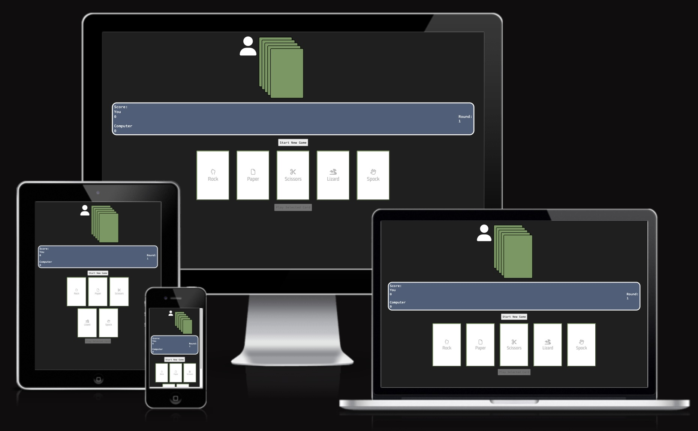

# RPSLS - Testing

## CONTENTS

* [Automated Testing](#Automated-Testing)
  * [W3C Validator](#W3C-HTML-Validation)
  * [Lighthouse](#Lighthouse)
  * [Am I Responsive](#Am-I-Responsive)

* [Manual Testing](#manual-testing)
  * [Devices](#Devices)
  * [All manual tests](#Tests-Performed-Per-Page)

Testing was performed continously during development. A large amount of credit goes to Chrome developer tools and the function to adjust device dimensions to simulate different devices.
At the last stage of development, Lighthouse (also in Chrome dev tools) was used to test site performance and fix a few things for SEO and accessibility, results from the Lighthouse test is included below.

## Automated Testing
### W3C HTML Validation

[W3C Validator](https://validator.w3.org/) was used to test all the HTML on the site

* index.html passed with no errors.
* Previously there were errors but they were fixed after considering the feedback generated by the validator
  * Sections were used without headers, this was based on a misunderstanding of their use, these were converted to divs to be more compliant with W3C.
  * Divs were used inside button elements, this works but is not correct according to W3C standards, these were converted to spans to be compliant.

### W3C CSS Validation

[W3C CSS Validator \(Jigsaw\)] (https://jigsaw.w3.org/css-validator/) was used to test the CSS

* style.css passed with no errors

### JSHint

[JSHint](https://jshint.com/) was used to test the JavaScript.

* There were two warnings generated after ES6 features were set to allowed. These referred to:
  * Risk of confusing semantics due to functions declared within loops referencing outer scoped variables. This is caused by the event listener for the action cards. Since it's only a warning it will be left as is, but there should be possible to improve.
  * "'async functions' is only available in ES8", ES8 and async functions are widely adopted by browsers so this is not a big issue, but the site will not work for browser without support for ES8.

### Lighthouse

I used Lighthouse within the Chrome Developer Tools to test the performance, accessibility, best practices and SEO of the website. 

__Desktop Scores__

__Mobile Scores__

### Am I Responsive Results

Below are the results from [Am I Responsive](https://ui.dev/amiresponsive)

* index.html

## MANUAL TESTING
### Devices

The site was fully tested with the following devices and browsers

* Macbook Pro 14-inch, 2023
  * Browser: Chrome, Safari
* Macbook Pro 15-inch, 2018
  * Browser: Safari
* iPhone 13
  * Browser: Safari
* iPhone 12 Mini
  * Browser: Safari

### Tests Performed Per Page

`RPSLS (index.html)`

| Feature | Expected Outcome | Testing Performed | Pass/Fail |
| --- | --- | --- | --- |
| "Start New Game" button | Prompts the player to pick an action and activates all player action cards. Also hides the "Start New Game" button. | Clicking or tapping | Pass |
| All player action cards | Raises the card clicked, and activates the "Play Selected Card" button | Clicking or tapping | Pass |
| All player action cards when already raised/selected | Lowers the card, and deactivates the "Play card" button | Clicking or tapping | Pass |
| "Play selected card" button | Starts a game round, makes status field say what action was picked, what action the computer picked and the outcome, if the player won their score should go up by one point, if the computer won the "computer score" should go up by one. If the result is a tie no score should go up. If the round number is lower than 5, the next round should start and the player should be prompted to pick another action. If the round is 5 after the winner of the round is declared the final game winner is announced based on the score, highest score wins, ties are possible. At the end of round 5 the "Start New Game" button should reappear. | Clicking or tapping | Pass |